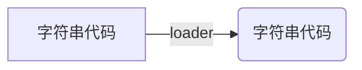

<!--
 * @Author: luoxi
 * @LastEditTime: 2022-03-19 22:44:22
 * @LastEditors: your name
 * @Description: loader
 * 
-->
- [loaders](#loaders)
  - [🧐 chunk中解析模块的更详细流程：](#-chunk中解析模块的更详细流程)
  - [🧐 处理loaders流程：](#-处理loaders流程)
  - [🧐 配置](#-配置)
#  loaders
webpack loader： loader本质上是一个函数，它的作用是将某个源码字符串转换成另一个源码字符串返回。

loader函数的将在模块解析的过程中被调用，以得到最终的源码。

## 🧐 chunk中解析模块的更详细流程：


可以看出处理``loader``的过程是在``ast``语法分析之前，参与打包过程，所以loader文件里不能用``ES module``。

## 🧐 处理loaders流程：


``loader``解析时候确实是从上往下，但执行``loader``的时候是从下往上，从``loader``数组的后面开始。

## 🧐 配置
```js
module.exports = {
    module: { //针对模块的配置
        rules: [ //模块匹配规则，可以存在多个规则
            { //每个规则是一个对象
                test: /\\.js$/, //匹配的模块正则
                use: ["模块路径1", "模块路径2"]//loader模块的路径，该字符串会被放置到require中
            }
        ]
    }
}
```